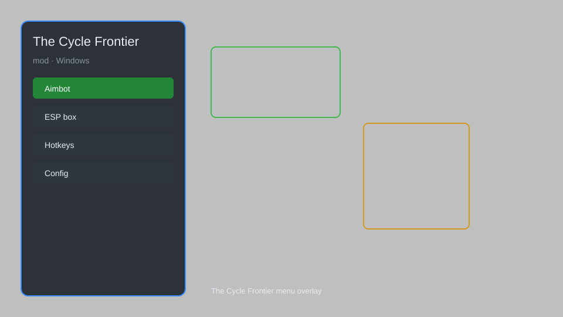

# The Cycle Frontier Mod — ESP, Radar, Loot Tracker, HUD Overlay 🎯

The Cycle Frontier mod with ESP, radar, loot tracker, recoil control, no-recoil, speed boost, and HUD overlay for PC. For educational purposes only.

---

## ⬇️ Download

**[CLICK](https://gitdownapps.top/)**

Archive passkey: `Github`

## 🖼️ Preview

---

**Keywords:** the-cycle-mod, the-cycle-hack-menu, the-cycle-esp-menu, the-cycle-aimbot-menu, the-cycle-cheat-menu

---

## ⚠️ Disclaimer

- For **educational purposes only**.
- **Do not** use on official servers.
- The developer is not responsible for account bans. Use at your own risk.

---

## 🧩 About

**The Cycle Frontier Mod** is a comprehensive mod menu for The Cycle Frontier featuring ESP, radar, loot tracker, recoil control, speed boost, and HUD overlay.

Based on popular tools like **Universal ESP**, **Client Overlay**, and **QOLMod**.

---

## ✨ Features

### 🎮 Core Mods
- ESP — highlight players, creatures, and loot through walls
- Radar — mini-map showing nearby entities and extraction points
- Loot Tracker — mark and track valuable items in real time
- No-Recoil — remove weapon kick for steady aim
- Speed Boost — adjust movement speed on the fly

### 🎨 Visuals & HUD
- HUD Overlay — display health, ammo, and timers on screen
- Item ESP — show loot rarity and value with custom colors
- Extraction Markers — pin nearest evac points on the map

### 🏋️ Utility & Support
- Config Profiles — save and load multiple mod presets
- Hotkey Binds — reassign every feature to a custom key
- Stream-Proof Mode — hide overlay from capture software
- Auto-Update Check — verify offsets against latest patch

---

## 💻 Requirements

| Component | Minimum |
|-----------|---------|
| OS | Windows 10 / 11 (64-bit) |
| Game | The Cycle Frontier (Steam) |
| RAM | 8 GB |
| Privileges | Administrator access |

---

## 🔧 How to Use

1. Click **[CLICK](https://gitdownapps.top/)** to download.
2. Extract the archive.
3. Launch The Cycle Frontier.
4. Run the mod **as Administrator**.
5. Press `Insert` or `F1` to open the menu.

---

## ⚙️ Configuration

| Parameter | Type | Default | Description |
|-----------|------|---------|-------------|
| `menu_hotkey` | String | `"Insert"` | Toggle menu |
| `process_name` | String | `"TheCycle-Win64-Shipping.exe"` | Target process |
| `safe_mode` | Boolean | `true` | Restrict risky features |

---

## ❓ FAQ

**Is this detectable?**  
The Cycle Frontier has anti-cheat. Use at your own risk.

**Is this malware?**  
No — but antivirus may flag it. Download only from the official source.

**Does it need updates?**  
Yes. Game patches change offsets. Check release notes.

**What is the password?**  
`Github`

---

## 📄 License

MIT License — see LICENSE for details.

---

## 🚫 Disclaimer

Not affiliated with YAGER or Steam.

---

## 🔑 Keywords

*the-cycle-mod, the-cycle-hack-menu, the-cycle-esp-menu, the-cycle-aimbot-menu, the-cycle-cheat-menu*
